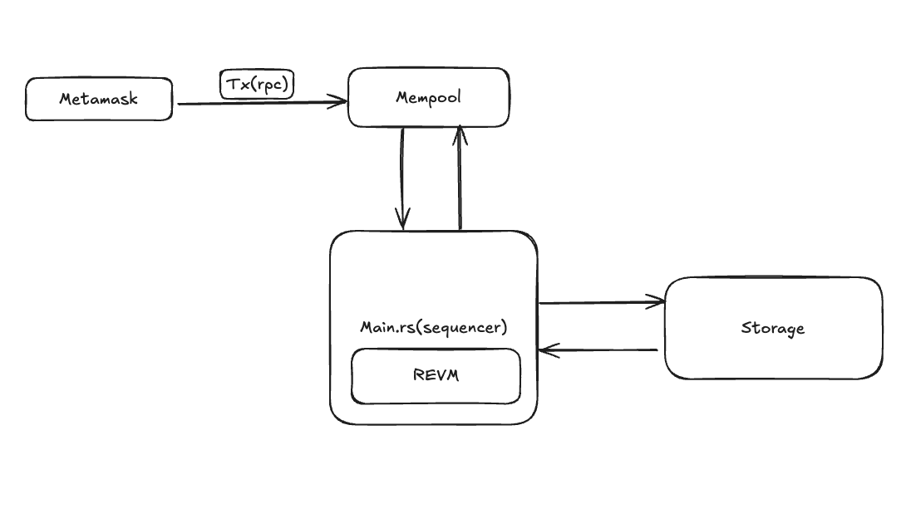

# Architecture

시퀀서는 정의하기 나름

일단 이런 구조를 단기적 목표로 ... 

bins/sequencer에 있는 main.rs에서 실행파일 실행 
(그니까 시퀀서 '실행'을 main.rs에서 할 것)
block_produce.workspace = true
evm.workspace = true 
등으로 모든 모듈을 의존해서 구현할 예정 

실행은 cargo run으로 실행하면 된다.
- 현재는 그냥 main.rs에서 간단한 revm 동작만 정의함

그 외 .. . 
라이브러리 프로젝트로 crates에다가 다른 모듈을 전부 정의한다.
모듈마다 고민해볼 지점들 정리 

각 모듈마다 테스트 코드 써서 그대로 작동하면 그냥 PR 하면 됨

- `block produce`
    블록 생성하는 로직
    - 일정 시간마다 생성할 것인가 아니면 tx 들어오면 생성할 것인가? (Arbitrum one)
    - 블록 자료구조를 어떻게 구성할 것인지 

- `evm`
    evm 다른 추가 설정... 
    - storage에 있는 db랑 revm db 호환 . .     
    - zkevm-circuit이랑 통신할 것에 대한 추가 설정

- `rpc`
    rpc 통신 로직 설정
    - rpc 핸들러 달기

- `storage`
    - storage 인터페이스 (state trie를 받을 db) 

- `mempool`
    - mempool 정의하고 tx 받기 
